# K2 ERP – Модуль обліку замовлень

**Мета:** створити невеликий модуль обліку замовлень, який демонструє вміння будувати бізнес-логіку, роботу з ORM, REST API, контейнеризацію та full-stack мислення.

---

## Що реалізовано

- **Сутності:** Клієнт, Товар, Замовлення (з позиціями через `OrderItem`).
- **REST API** на Django REST Framework:
  - `GET /api/` — корінь API, що повертає посилання на основні розділи
  - `POST /api/clients/` — створити клієнта
  - `POST /api/products/` — створити товар
  - `POST /api/orders/` — створити замовлення
  - `GET /api/orders/?client_id=1` — список замовлень клієнта
  - `GET /api/orders/{id}/` — деталі замовлення
  - `PATCH /api/orders/{id}/status/` — змінити статус замовлення
  - `GET /api/health/` — health check
- **Бізнес-правила:**
  - Не можна створити замовлення без клієнта.
  - У замовленні має бути хоча б один товар.
  - Сума замовлення розраховується автоматично на основі позицій.
  - Ціна товару фіксується на момент створення позиції (захист від подальшої зміни ціни товару).
  - Заборонено видаляти товар, якщо він є в замовленнях (`409 Conflict`).
  - Статус замовлення можна змінювати за правилами:
    * Виконане (`completed`) або скасоване (`cancelled`) замовлення не можна змінювати.
    * Не можна повернути замовлення зі статусу `processing` назад до стану `new`.
- **Django Admin** – готовий функціональний інтерфейс для менеджерів.
- **Swagger UI** (`/api/schema/swagger-ui/`) та **ReDoc** (`/api/schema/redoc/`) для інтерактивного дослідження API.
- **HTML‑форма** створення замовлення (`/api/order-form/`) з динамічним завантаженням даних через асинхронні запити до API.
- **TypeScript** з автоматичною компіляцією на етапі збірки Docker-образу.
- **Docker Compose** з окремими конфігураціями для `production` (Gunicorn) та `development` (runserver).
- **Автотести** (24 тести, pytest) — перевіряють працездатність API та дотримання бізнес-правил на рівні моделей і серіалізаторів.
- **Команда `seed_data`** для швидкого наповнення бази даних тестовими сутностями.

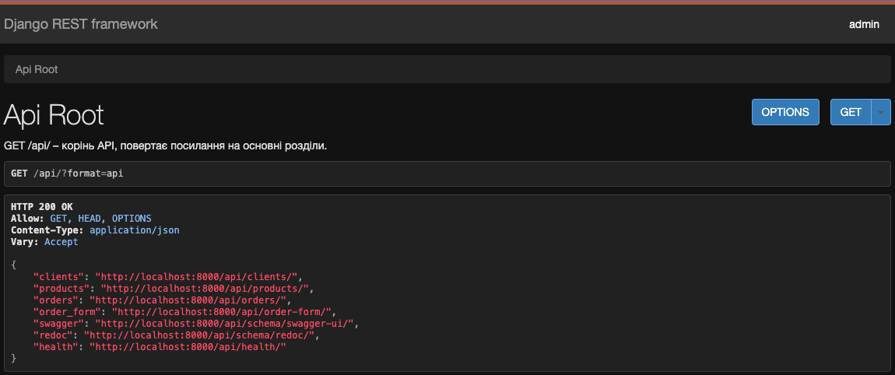

---

## Чому обрано Django, а не Flask/FastAPI

Django надає «з коробки» надійний фундамент для побудови корпоративних рішень:
- Зрілу та функціональну ORM з автоматичною генерацією міграцій.
- Готову адмін-панель (швидкий frontend-інструмент для оперативного MVP та менеджерів).
- Вбудовану систему прав доступу, автентифікації та захисту від поширених уразливостей.
- Чітку, стандартизовану структуру проєкту, що спрощує командну розробку.

Для ERP-системи, яка зазвичай є монолітом з глибокою, розгалуженою бізнес-логікою, вибір Django дозволяє пришвидшити розробку нових модулів та спростити їх супровід у довгостроковій перспективі. FastAPI чудовий для високонавантажених мікросервісів, але потребує окремого ручного підбору ORM, валідації, автентифікації та адмін-панелі, що суттєво збільшує час старту та підвищує ризики архітектурних розбіжностей.

---

## Змінні середовища

Проєкт використовує файл `.env` для збереження налаштувань. Створіть файл `.env` у корені проєкту (зразок `.env.example` додається) та заповніть свої значення.

Мінімальний вміст файлу `.env` для запуску:
```ini
DJANGO_SECRET_KEY=django-insecure-k2-erp-test-key-replace-this-in-production
DJANGO_DEBUG=True
DB_NAME=k2_erp
DB_USER=k2_user
DB_PASSWORD=k2_password
DB_HOST=db
DB_PORT=5432
DJANGO_ALLOWED_HOSTS=*
```

**Опис основних змінних:**

| Змінна | Призначення | Приклад |
| :--- | :--- | :--- |
| `DJANGO_SECRET_KEY` | Секретний ключ Django (обов'язково) | `django-insecure-...` |
| `DJANGO_DEBUG` | Режим налагодження (`True`/`False`) | `True` |
| `DB_NAME` | Ім'я бази даних PostgreSQL | `k2_erp` |
| `DB_USER` | Користувач бази даних | `k2_user` |
| `DB_PASSWORD` | Пароль до бази даних | `k2_password` |
| `DB_HOST` | Хост бази даних (`db` для Docker, `localhost` інакше) | `db` |
| `DB_PORT` | Порт бази даних | `5432` |
| `DJANGO_ALLOWED_HOSTS` | Список дозволених хостів (доменів) через кому. Для розробки — *, для production — конкретні домени.| `*` або `example.com,www.example.com` |

---

## Структура проєкту

```text
order-management-service/
├── config/                      # Налаштування Django (settings, urls, wsgi)
│   ├── asgi.py
│   ├── settings.py
│   ├── urls.py
│   └── wsgi.py
├── modules/                     # Модулі ERP системи
│   └── orders/                  # Модуль обліку замовлень
│       ├── models.py            # Моделі: Client, Product, Order, OrderItem
│       ├── serializers.py       # DRF серіалізатори
│       ├── views.py             # API views + HealthCheck + OrderFormView
│       ├── urls.py              # URL-маршрути модуля замовлень
│       ├── admin.py             # Реєстрація моделей в Django Admin
│       ├── tests.py             # Unit-тести (pytest)
│       ├── management/
│       │   └── commands/
│       │       └── seed_data.py # Команда для автоматичної генерації тестових даних
│       ├── static/orders/
│       │   ├── css/order_form.css
│       │   ├── js/order_form.js # Скомпільований JS (з TypeScript)
│       │   └── ts/              # TypeScript-джерела + tsconfig.json + package.json
│       └── templates/orders/
│           └── order_form.html  # HTML-форма створення замовлення
├── static/                      # Глобальна статика (base.css)
│   └── css/base.css
├── templates/
│   └── base.html                # Базовий шаблон оформлення
├── .env.sample                  # Зразок файлу змінних середовища
├── docker-compose.yml           # Production-конфігурація (Gunicorn, без монтування коду)
├── docker-compose.override.yml  # Dev-конфігурація (runserver + монтування томів)
├── Dockerfile
├── entrypoint.sh                # Dev-точка входу (runserver)
├── entrypoint.prod.sh           # Production-точка входу (Gunicorn)
├── requirements.txt
├── manage.py
├── pytest.ini
└── README.md
```

---

## Швидкий старт (локально, без Docker)

1. Клонуйте репозиторій і перейдіть у папку проєкту:
   ```bash
   git clone https://github.com/your-username/order-management-service.git
   cd order-management-service
   ```

2. Створіть віртуальне середовище та встановіть залежності:
   ```bash
   python -m venv .venv
   source .venv/bin/activate  # Для Windows (PowerShell): .venv\Scripts\activate
   pip install -r requirements.txt
   ```
   *(У складі залежностей є pytest та pytest-django – все для запусків тестів готове).*

3. Налаштуйте файл `.env` (див. розділ «Змінні середовища»).

4. Для локального запуску без Docker зручно використовувати SQLite. Замініть `DATABASES` у `config/settings.py` на:
   ```python
   DATABASES = {
       'default': {
           'ENGINE': 'django.db.backends.sqlite3',
           'NAME': BASE_DIR / 'db.sqlite3',
       }
   }
   ```

5. Виконайте міграції:
   ```bash
   python manage.py migrate
   ```

6. Запустіть сервер розробки:
   ```bash
   python manage.py runserver
   ```

7. Створіть суперкористувача (для доступу до адмінки):
   ```bash
   python manage.py createsuperuser
   ```

8. Наповніть базу даних початковими тестовими даними:
   ```bash
   python manage.py seed_data
   ```

9. Відкрийте у браузері:
   - **REST API:** http://localhost:8000/api/
   - **Форма замовлення:** http://localhost:8000/api/order-form/
   - **Адмінка:** http://localhost:8000/admin/
   - **Swagger:** http://localhost:8000/api/schema/swagger-ui/
   - **ReDoc:** http://localhost:8000/api/schema/redoc/

10. Запустіть тести:
    ```bash
    pytest modules/orders/tests.py -v
    ```
    *(Переконайтесь, що віртуальне середовище `.venv` активоване).*

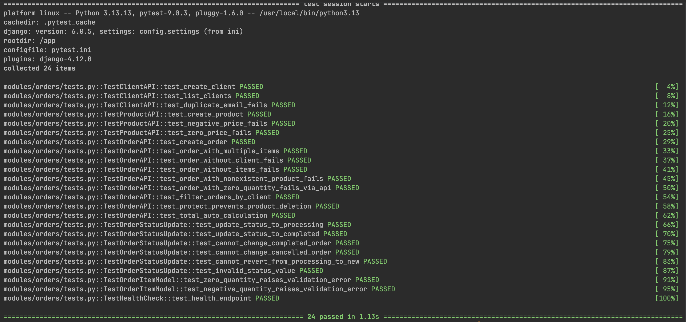

---

## Запуск через Docker (production-режим)

1. Зберіть та запустіть контейнери:
   ```bash
   docker-compose up --build
   ```
   У цьому режимі:
   - Код запакований у образ (немає монтування томів з хоста).
   - Використовується Gunicorn (production WSGI сервер).
   - TypeScript компілюється на окремому stage збірки (multi-stage build): Node.js потрібен лише під час `docker build`, у фінальний Python-образ він не потрапляє.

2. Виконайте міграції (вони виконуються автоматично в `entrypoint.prod.sh`, але можна запустити вручну):
   ```bash
   docker-compose exec web python manage.py migrate
   ```

3. Створіть суперкористувача:
   ```bash
   docker-compose exec web python manage.py createsuperuser
   ```

4. Наповніть базу тестовими даними:
   ```bash
   docker-compose exec web python manage.py seed_data
   ```

5. Відкрийте у браузері ті ж самі URL, що й для локального запуску.

6. Запустіть тести всередині контейнера:
   ```bash
   docker-compose exec web pytest modules/orders/tests.py -v
   ```

---

## Розробка (development-режим з Docker)

Якщо в папці присутній файл `docker-compose.override.yml` (dev), то команда `docker-compose up` автоматично:
- монтує поточну локальну директорію в контейнер (зміни коду застосовуються миттєво без перезбірки),
- використовує стандартний налагоджувальний сервер `runserver` замість Gunicorn.

Це найбільш зручно для локальної повсякденної розробки. Для чистого production-запуску тимчасово перейменуйте або видаліть `docker-compose.override.yml`.

---

## Адмінка Django

- **URL:** http://localhost:8000/admin/
- Увійдіть за допомогою облікових даних створеного суперкористувача.

Інтерфейс дозволяє переглядати, створювати та редагувати клієнтів, товари і замовлення.
Панель керування надає повний доступ до адміністрування бізнес-сутностей системи.

### Головна сторінка адміністрування
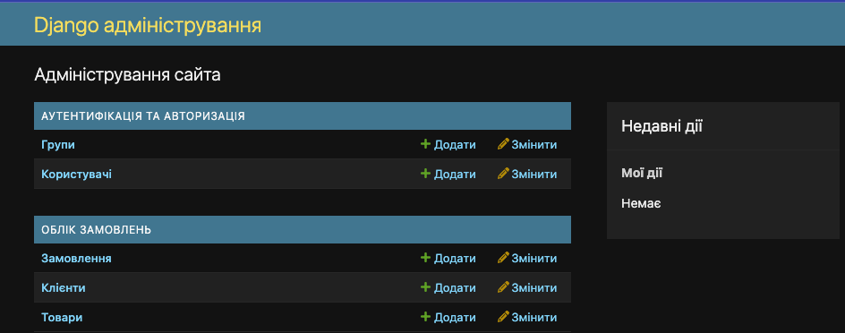

### Списки сутностей (Клієнти, Товари, Замовлення)
Ви можете зручно фільтрувати замовлення за станом чи часом створення, а також здійснювати повнотекстовий пошук по ключових полях:

**Список замовлень:**
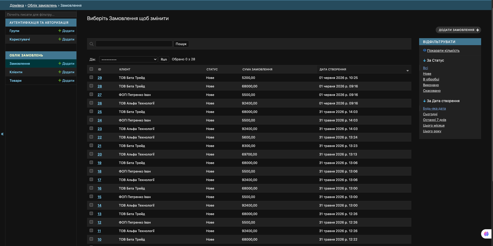
<br>

**Список клієнтів:**
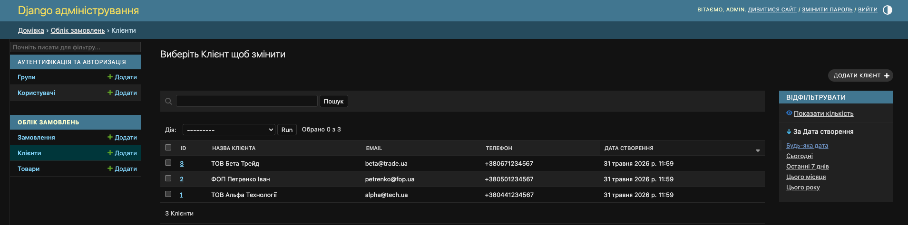
<br>

**Список товарів:**
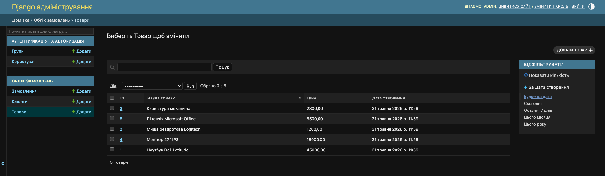

### Редагування та додавання сутностей
Адмінка підтримує тонке коригування та додавання окремих сутностей:

**Форма зміни клієнта:**
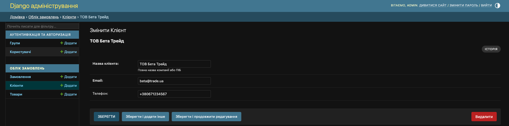
<br>

**Форма зміни товару:**
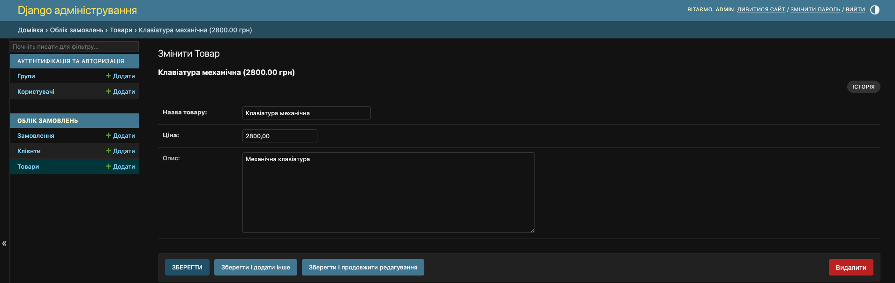

У формі замовлення позиції товарів додаються безпосередньо в тому самому вікні (inline), а загальна сума замовлення перераховується автоматично при збереженні:

**Форма зміни замовлення з вкладеними inline-позиціями:**
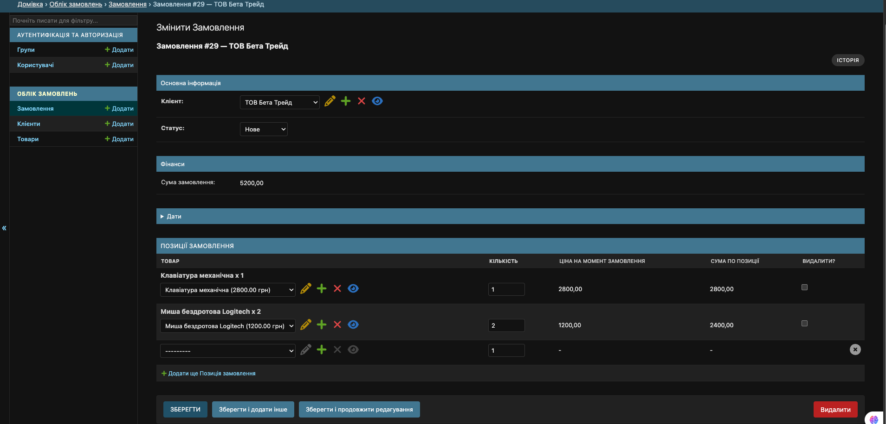

---

## API та документація

### Клієнти та Товари
Через вебінтерфейс Django REST Framework ви можете зручно переглядати та наповнювати довідники клієнтів та товарів:

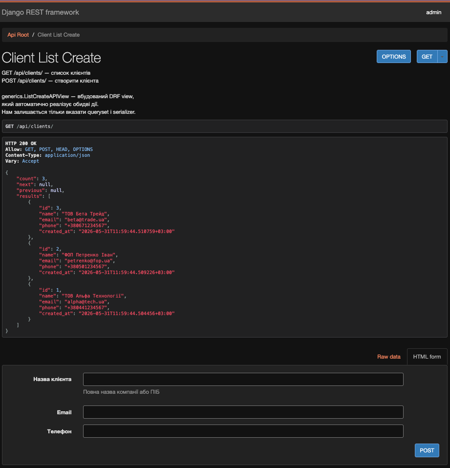
<br>
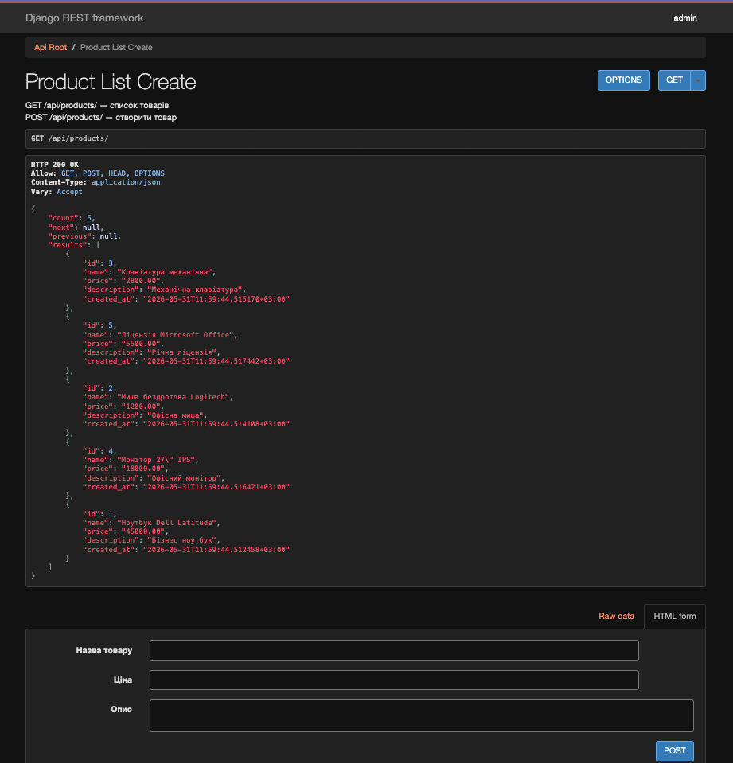

### Замовлення та деталізація
Ендпоінт замовлень повертає інформацію про кожну позицію, розраховані суми та закріплені ціни на момент фіксації операції:

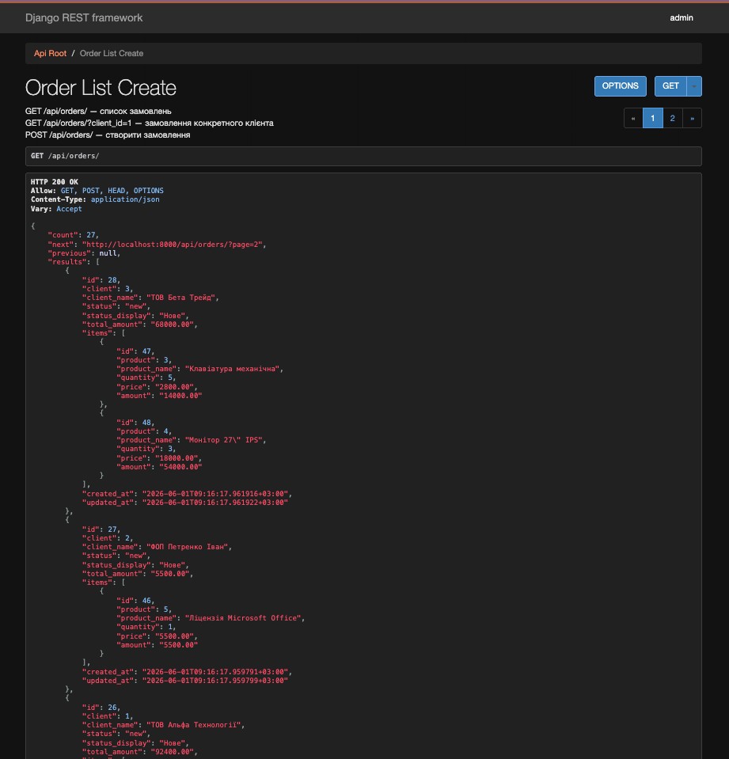

### Health Check (Стан системи)
Служить для інтеграції з моніторингом, балансувальниками трафіку або Docker healthcheck. Повертає статус підключення до бази даних:

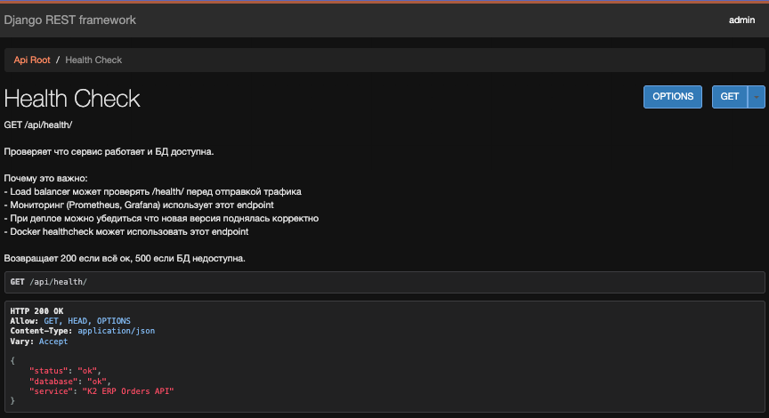

### Swagger UI та ReDoc
У проєкт інтегровано автоматичну генерацію специфікації OpenAPI 3.0:

- **Swagger UI:** `/api/schema/swagger-ui/` – інтерактивна документація з можливістю надсилати тестові запити прямо з інтерфейсу браузера.
- **ReDoc:** `/api/schema/redoc/` – альтернативний, лаконічний формат документації.

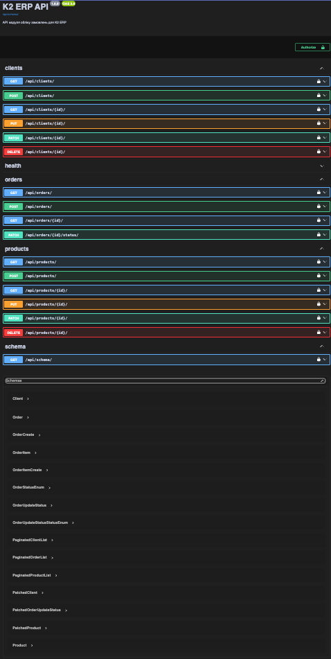
<br>
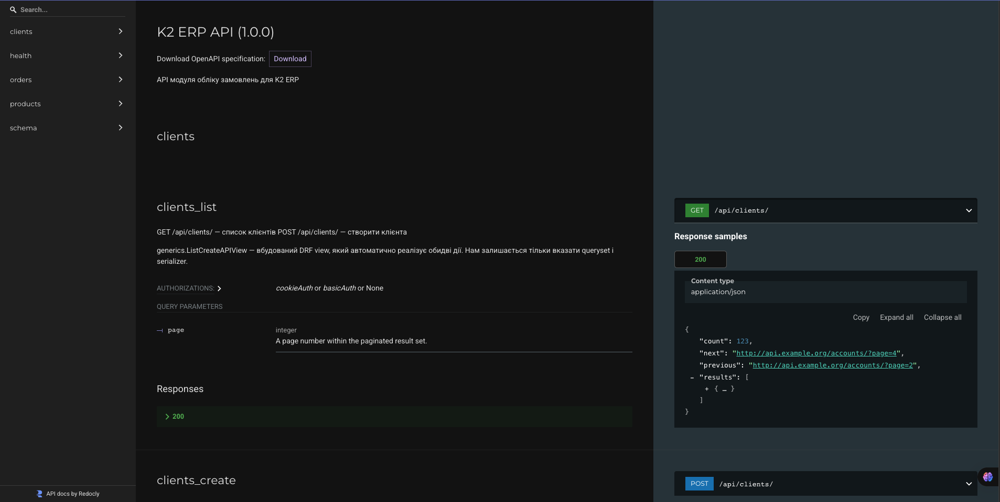

---

### Приклад створення замовлення через curl
```bash
curl -X POST http://localhost:8000/api/orders/ \
  -H 'Content-Type: application/json' \
  -d '{
    "client_id": 1,
    "items": [
      {"product_id": 1, "quantity": 2},
      {"product_id": 2, "quantity": 1}
    ]
  }'
```
При успішному створенні повернеться статус `201 Created` з деталями сформованого замовлення та автоматично обчисленою сумою.

### Приклад зміни статусу замовлення
```bash
curl -X PATCH http://localhost:8000/api/orders/1/status/ \
  -H 'Content-Type: application/json' \
  -d '{"status": "processing"}'
```

Допустимі значення статусу:
* `new` – Нове (за замовчуванням)
* `processing` – В обробці
* `completed` – Виконано
* `cancelled` – Скасовано

**Бізнес-правила зміни статусу замовлення:**
* Виконане замовлення (`completed`) не можна змінювати.
* Скасоване замовлення (`cancelled`) не можна змінювати.
* Не можна повернути замовлення зі статусу `processing` назад до стану `new`.

При успішному оновленні повертається статус `200 OK` та повний об'єкт замовлення з оновленим статусом.

---

## HTML‑форма (Замовлення через інтерфейс)

Форма доступна за адресою `/api/order-form/`. Дані про клієнтів та актуальні товари завантажуються асинхронно з API, після чого користувач може динамічно додавати, видаляти та коригувати позиції замовлення в один клік.

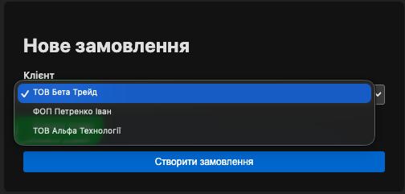 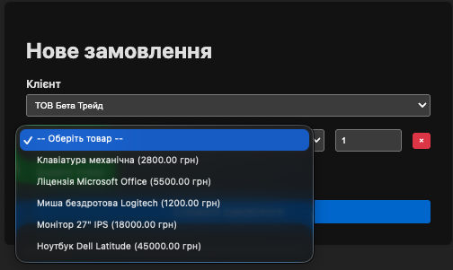

---

## TypeScript

- **Вихідний код:** `modules/orders/static/orders/ts/order_form.ts`
- **Збірка:** Компілюється під час `docker build` у файл `../js/order_form.js`
- Для локальної компіляції (необхідно мати встановлений Node.js):
  ```bash
  cd modules/orders/static/orders/ts
  npm install
  npx tsc
  ```
У продакшн-середовищі збірка здійснюється всередині багатоетапного (multi-stage) Docker-образу, тому встановлювати Node.js на робочому сервері немає необхідності.

---

## Технологічний стек

| Компонент | Технології                                                                          |
| :--- | :--- |
| **Backend** | Python 3.13, Django 6.0, Django REST Framework                                      |
| **База даних** | PostgreSQL (у Docker Compose), локально підтримується SQLite                        |
| **Фронтенд** | HTML / CSS / JavaScript (Vanilla), TypeScript (для демонстрації full-stack навичок) |
| **Документація API** | drf-spectacular (OpenAPI 3.0)                                                       |
| **Тестування** | pytest, pytest-django                                                               |
| **Контейнеризація**| Docker, Docker Compose (prod: Gunicorn, dev: runserver)                             |
| **WSGI-сервер** | Gunicorn                                                                            |

---

Успішного тестування! 📈